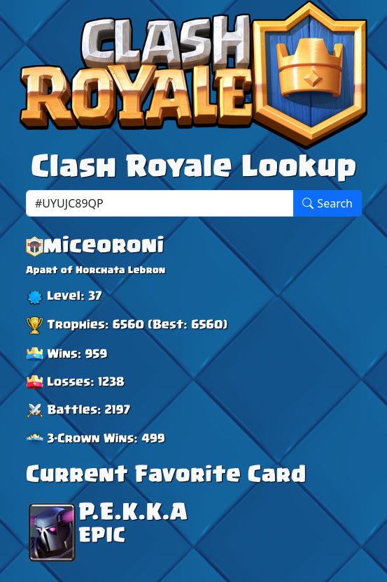

# ClashRoyaleLookup

Clash Royale Lookup is a website/webapp that presents player stats in a simple format without distractions.

View the demo [here.](https://clashlookup.miceoroni.lol/)



## Features
- Wins
- Losses
- Trophies
- Experience Level
- Battles
- Three Crown Wins
- Favorite Card
## Tech Stack

ASP.NET (C#) is utilized for the backend, while a mixture of Bootstrap (CSS Framework) and vanilla Javascript is utilized for the frontend. 

## Requirements

A [Clash Royale API Key](https://developer.clashroyale.com/) is needed to perform searches. 
.NET SDK 9.0 is needed as well.

## Installation

Use git to clone the repository, then use dotnet to compile and run the program. 
Ensure that you have set the key in appsettings.json to your API key.

```bash
git clone https://github.com/miceoroni/ClashRoyaleLookup.git
cd ClashRoyaleLookup
nano appsettings.json
dotnet build -c Release
ClashRoyaleLookup
```

## Usage
Just simply run ClashRoyaleLookup. It should spawn a webserver on localhost:5000.
Grab a player tag by following this [guide.](https://support.supercell.com/hay-day/en/articles/player-tag.html)

## Support
For support, please utilize the issues section. I will try my best to look into the issue and (hopefully) fix it.

## Credit

- Supercell - Assets and API - All content here is utilized under fair use and does not violate the Fan Content Policy.

## License

[AGPL 3.0](https://choosealicense.com/licenses/agpl-3.0/)
